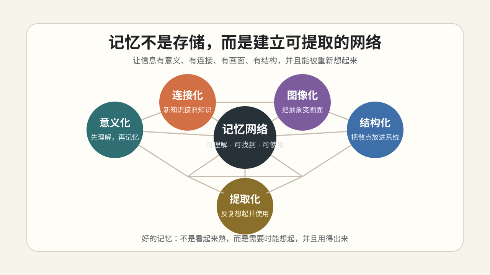

# 如何更好地记东西：从死记硬背到建立记忆网络

很多人以为记忆就是“多看几遍”“多背几遍”。

但真正有效的记忆，不是把信息硬塞进脑子，而是让信息变得：

> 有意义、有连接、有画面、有结构，并且能被重新提取出来。

换句话说，记忆不是存储，而是建立一张可以被找到的网络。

## 一、意义化：先理解，再记忆

最难记的东西，往往不是复杂，而是陌生、抽象、没有意义。

所以第一步不是背，而是先问：

- 它到底是什么意思？
- 它解决什么问题？
- 我能不能用自己的话解释？
- 我能不能举一个例子？

比如记一个单词，不要只记中文释义。还要知道它在什么语境下使用，表达什么感觉，和哪些词搭配。

常用方法：

- 精细加工
- 费曼技巧
- 自己举例
- 用自己的话解释

核心：

> 理解越深，记忆越稳。

## 二、连接化：把新信息挂到旧知识上

孤立的信息最难记。

一个新东西，如果能和你已有的知识、经验、情绪、场景发生连接，就更容易留下来。

可以问：

- 它像什么？
- 它和我知道的什么东西有关？
- 它的近义词、反义词是什么？
- 它能连接到哪个真实场景？

比如记 `fragile`，可以联想到玻璃杯、快递箱、易碎标签。这样它不再只是一个单词，而是挂在一组熟悉经验上。

常用方法：

- 联想
- 类比
- 词根词缀
- 近义词 / 反义词
- 生活经验连接

核心：

> 新知识要接到旧知识上，才有抓手。

## 三、图像化：把抽象变成画面

大脑不擅长记抽象符号，但很擅长记画面、动作、空间、情绪和故事。

所以记忆时，可以刻意把信息变成画面。

比如记 `reluctant`，不要只记“不情愿的”。可以想象一个人死死抓着门框，不愿意进会议室。

这个画面越具体、越夸张，越容易记住。

常用方法：

- 想象
- 故事串联
- 记忆宫殿
- 双重编码

核心：

> 能看见的东西，比纯文字更容易记住。

## 四、结构化：把零散信息放进系统

记不住，有时不是信息太多，而是信息太散。

结构化的作用，是让你知道每个东西放在哪里。

可以问：

- 它属于哪一类？
- 它和其他内容是什么关系？
- 哪些东西容易混淆？
- 能不能画成表格、框架图或分类图？

比如背单词，可以按场景分类：

- 情绪表达
- 工作沟通
- 金融投资
- 日常动作
- 抽象概念

也可以把容易混的词放在一起比较：

- `effective`：有效果
- `efficient`：有效率

常用方法：

- 分类整理
- 组块化
- 框架图
- 对比辨析
- 知识地图

核心：

> 记忆不是堆东西，而是把东西放到正确的位置。

## 五、提取化：把“看懂”变成“想得起”

很多人以为自己记住了，其实只是“看见时认识”。

真正的记忆，要看不看答案时能不能想起来。

所以复习时，不要只反复阅读，而要主动提取：

- 合上书，自己说出来
- 看中文，回忆英文
- 看问题，写出答案
- 用自己的话复述
- 用它造句

间隔重复也很重要。不是一天看十遍，而是隔一段时间重新想起它。

常用方法：

- 主动回忆
- 测试效应
- 间隔重复
- 最小卡片
- 造句
- 迁移使用

核心：

> 反复看，不如反复想起来。

## 记单词的实用流程

记一个单词，可以按这个顺序：

1. 理解核心意思
2. 看真实例句
3. 记常见搭配
4. 建立联想或画面
5. 放进具体场景
6. 和易混词对比
7. 自己造句
8. 隔几天主动回忆
9. 在真实表达里用一次

比如 `negotiate`：

- 意思：谈判，协商
- 搭配：`negotiate with someone` / `negotiate a deal`
- 场景：和客户谈价格，和同事协商时间
- 造句：`We need to negotiate the deadline with the client.`

这样记的不是一个孤立单词，而是一组可使用的语言经验。

## 总结

好的记忆，可以用五个步骤理解：

| 维度 | 目的 | 常用方法 |
|---|---|---|
| 意义化 | 理解它 | 解释、举例、费曼技巧 |
| 连接化 | 挂住它 | 联想、类比、词根、相关知识 |
| 图像化 | 看见它 | 想象、故事、记忆宫殿 |
| 结构化 | 放好它 | 分类、组块、框架、对比 |
| 提取化 | 用出来 | 主动回忆、间隔重复、造句 |

一句话：

> 记忆不是重复输入，而是理解、连接、组织、提取和使用。

真正记住一个东西，不是你看见它时觉得熟，而是你需要它时，它能被你想起来，并且用得出来。

---

## 发布信息

- 发布日期：2026-06-15
- 更新日期：2026-06-15
