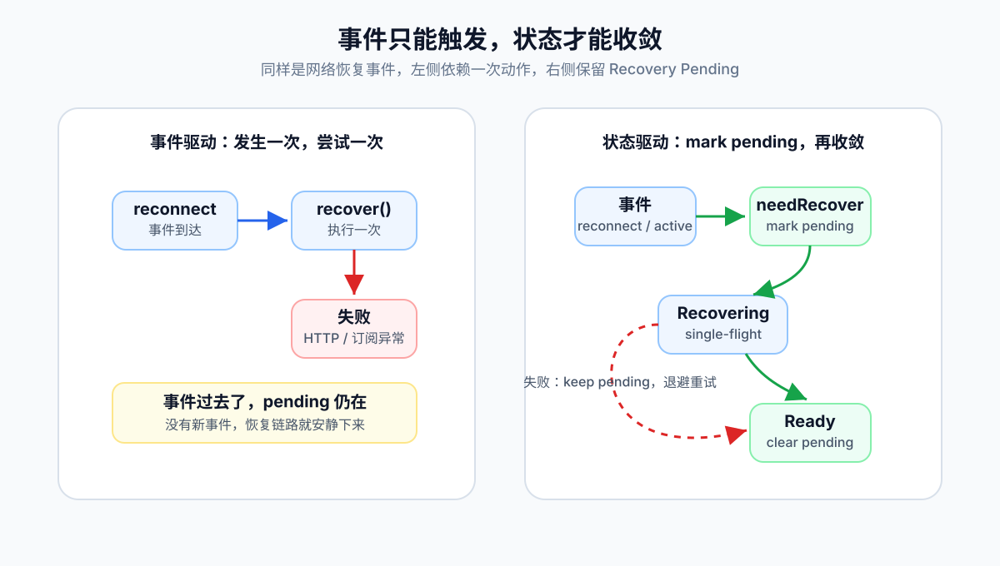
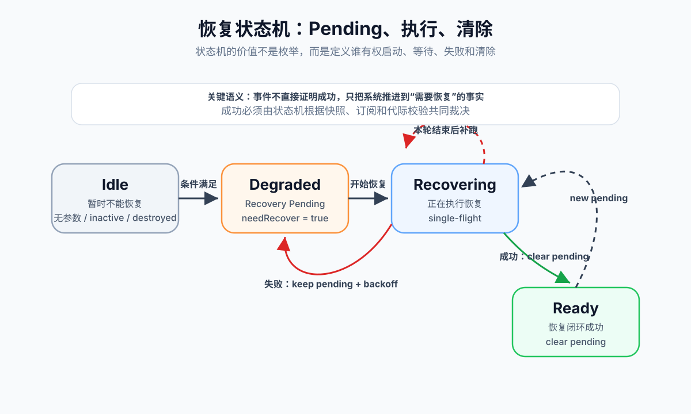
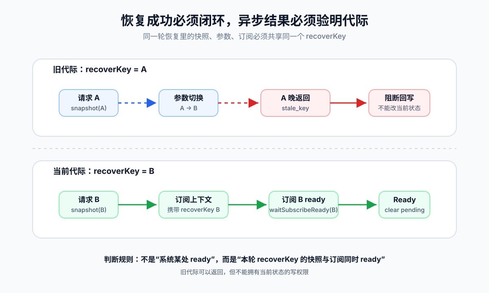

# 实时系统恢复设计：从事件驱动到状态驱动

实时系统里，最容易被低估的不是连接，而是恢复。

连接断了重连，重连后补一次快照，这看起来像是恢复。  
但在复杂链路里，这往往只是“做过一次恢复动作”，不等于“系统已经恢复”。

真正的问题在这里：

**事件只能告诉你某件事发生过，状态才能告诉你系统现在需要什么。**

这篇文章讨论的就是这个差别。

## 一个简单场景

假设有一个实时排名系统。

页面打开时，前端先通过 HTTP 拉取当前排名快照，用它渲染首屏；随后建立 WebSocket 订阅，接收后续的名次变化、指标变化和状态变化。

这条链路天然分成两段：

1. HTTP 快照：给出某一刻的完整基线
2. WebSocket 增量：让页面持续跟上后续变化

正常情况下，一切都很顺：

- HTTP 返回当前排名
- WebSocket 连接成功
- 页面持续收到增量，排名不断变化

但只要网络断开几秒再恢复，事情就不再简单。

WebSocket 可能已经重新连上，HTTP 快照也可能重新请求过，但页面仍然停在旧数据上。原因可能是：

- HTTP 快照失败了，之后没有继续恢复
- WebSocket 连上了，但新订阅没有真正建立
- 排名维度已经切换，旧请求晚回来覆盖了新状态
- 旧连接的 close 事件迟到，把新连接又打断了

这些现象表面上都像“重连不稳定”。但更准确地说，是系统没有定义清楚：

**什么叫恢复成功？失败以后谁负责继续恢复？旧异步结果凭什么还能改当前状态？**

如果这三个问题没有答案，恢复逻辑就只是若干事件回调的堆叠。

## 事件驱动恢复的错觉

很多系统的恢复逻辑一开始都长这样：

```ts
reconnect$.pipe(
  throttleTime(2000),
  switchMap(() => fetchSnapshot()),
).subscribe(applySnapshot);
```

再谨慎一点，加一个定时兜底：

```ts
timer(0, 5000).pipe(
  switchMap(() => fetchSnapshot()),
).subscribe(applySnapshot);
```

这类代码的问题不是“不工作”。它的问题是太容易让人误以为“触发过恢复”等于“系统会恢复”。

事件驱动恢复隐含了三个脆弱假设。

第一，假设事件不会丢。

但重连事件经常抖动，节流会吞事件，页面生命周期会错过事件，SharedWorker 常驻时刷新页面也不一定重建底层连接。

第二，假设一次恢复能成功。

但恢复本身由多个异步步骤组成：HTTP、参数校验、订阅参数生成、WebSocket ready、订阅建立。任何一步失败，系统仍然处于未恢复状态。

第三，假设旧结果不会回来捣乱。

但异步系统里，旧请求晚到、旧 socket 迟到 close、旧订阅流程继续执行，都是常态，不是异常。

所以事件驱动恢复真正危险的地方，不是它会失败，而是它失败以后没有记忆。

一次事件过去了，`Recovery Pending` 仍然存在。  
但代码已经安静了。



## 恢复应该是 Pending 状态，不是动作

恢复的第一性原理应该是：

**只要系统还没回到可验证的正常状态，就应该保持 `Recovery Pending`。**

`Recovery Pending` 表示：系统已经知道当前状态不可信，并且仍需要完成一轮可验证的恢复。

事件仍然有用，但事件不应该直接承担恢复语义。事件只负责把系统标记为“需要恢复”：

```ts
requestRecover(reason, { immediate });
```

它的核心不是“立刻跑一次函数”，而是先标记状态：

```ts
requestRecover(reason: string, options: { immediate: boolean }) {
  this.needRecover = true;
  this.lastRecoverReason = reason;

  if (!this.canRecover()) {
    this.state = "Idle";
    return;
  }

  if (this.recovering) {
    this.dirty = true;
    return;
  }

  options.immediate ? this.runRecover() : this.scheduleBackoff();
}
```

这里最关键的一行是：

```ts
this.needRecover = true;
```

它把一个瞬时事件翻译成了一个持续事实。

网络恢复、参数变化、页面重新 active、服务端提示版本过旧，这些触发源不再各自执行一套恢复逻辑。它们只是在表达同一件事：

**当前状态不可信，需要重新收敛。**

## 状态机不是仪式，是边界

恢复状态机可以很小：

```ts
type RecoveryState =
  | "Idle"
  | "Degraded"
  | "Recovering"
  | "Ready";
```

这四个状态已经足够表达关键边界：

- `Idle`：暂时不能恢复，比如无参数、页面 inactive、服务已销毁
- `Degraded`：`Recovery Pending`，等待执行或退避
- `Recovering`：正在执行一轮恢复
- `Ready`：最近一轮恢复通过了完整成功判定

很多人把状态机理解成“多几个枚举值”。这不是重点。

状态机真正提供的是裁决权：

- 当前能不能恢复
- 是否已经有恢复在执行
- 失败后 `Recovery Pending` 是否保留
- 成功后 `Recovery Pending` 能否清除
- 旧结果还能不能回写

没有这些边界，恢复逻辑会退化成回调之间的互相猜测。



## Single-flight：恢复要持续，但不能并发

状态驱动不等于疯狂重试。

实时链路的恢复触发源很多：重连、active、参数变化、订阅异常、心跳异常、版本过旧。它们可能在几百毫秒内同时发生。

如果每个事件都启动一轮 HTTP + WebSocket 恢复，系统会在最脆弱的时候制造并发风暴。

恢复必须 single-flight：

```ts
async runRecover() {
  if (this.recovering || !this.needRecover || !this.canRecover()) {
    return;
  }

  this.recovering = true;
  this.state = "Recovering";

  try {
    const result = await this.recoverOnce();
    result.status === "success"
      ? this.markSuccess()
      : this.markFailure(result.reason);
  } finally {
    this.recovering = false;

    if (this.needRecover && this.dirty) {
      this.dirty = false;
      void this.runRecover();
      return;
    }

    if (this.needRecover) {
      this.scheduleBackoff();
    }
  }
}
```

这里的 `dirty` 很重要。

它表达的是：恢复执行期间，系统又发生了新变化。本轮可以继续跑完，但结束后必须补一轮。

这比直接取消或并发启动都更稳：

- 不并发，避免请求风暴
- 不丢触发，避免恢复失忆
- 不依赖下一次外部事件，避免永久卡住

## Backoff：自愈不是轮询

失败后继续恢复是必要的，但固定频率硬打不是自愈，只是焦虑。

更合理的做法是保持 `Recovery Pending`，然后退避：

```ts
const BACKOFF = [1000, 2000, 5000, 10000];

markFailure(reason: RecoverFailureReason) {
  this.needRecover = true;
  this.state = "Degraded";
  this.attempt += 1;
  this.lastError = reason;
  this.schedule(BACKOFF[Math.min(this.attempt, BACKOFF.length - 1)]);
}
```

成功时才清除 `Recovery Pending`：

```ts
markSuccess() {
  this.needRecover = false;
  this.dirty = false;
  this.attempt = 0;
  this.state = "Ready";
  this.lastSuccessAt = Date.now();
}
```

关键不是退避数组怎么写，而是语义要清楚：

**失败不会让恢复结束，成功才会。**

## 恢复成功不能只看 HTTP

HTTP 快照成功，只能说明你拿到了一份基线。

在实时排名系统里，真正恢复至少要满足两个条件：

1. 快照请求成功，并且属于当前参数
2. 对应这次快照的 WebSocket 增量订阅已经建立

否则就是假恢复。

```ts
async recoverOnce(): Promise<RecoverResult> {
  const recoverKey = buildKey(this.params);

  const snapshot = await this.fetchSnapshot(this.params);
  if (!snapshot.ok) {
    return { status: "failed", reason: "snapshot_failed" };
  }

  if (buildKey(this.params) !== recoverKey) {
    return { status: "failed", reason: "stale_snapshot" };
  }

  this.publishSubscribeContext({
    version: snapshot.version,
    channel: snapshot.channel,
    recoverKey,
  });

  const ready = await this.waitSubscribeReady(recoverKey, 3000);
  if (!ready) {
    return { status: "failed", reason: "subscribe_timeout" };
  }

  return { status: "success" };
}
```

注意这里不是等待“任意订阅 ready”，而是等待“这个 `recoverKey` 对应的订阅 ready”。

这是很多恢复 bug 的根源：系统把全局 ready 误当成本轮 ready。

如果参数从 A 切到 B，B 的订阅 ready 不能证明 A 的恢复成功。  
如果旧请求返回后生成了旧订阅参数，也不能允许它用旧 key 改写当前链路。

恢复成功必须闭环：

**本轮快照、本轮参数、本轮订阅，三者必须属于同一个代际。**



## 代际隔离：异步结果必须证明自己还有效

实时系统里，最不可信的是“晚到的正确结果”。

它在发起时可能是正确的，但回来时世界已经变了。

所以每轮恢复都应该固化一个代际：

```ts
const epoch = ++this.epoch;
const recoverKey = buildKey(this.params);
```

回写前校验：

```ts
if (epoch !== this.epoch) {
  return { status: "failed", reason: "stale_epoch" };
}

if (buildKey(this.params) !== recoverKey) {
  return { status: "failed", reason: "stale_key" };
}
```

这个规则要足够冷酷：

**不能证明自己属于当前世界的异步结果，一律不能回写全局状态。**

它适用于 HTTP 响应，也适用于订阅参数、订阅等待、socket open/close。

## 旧订阅流程也要被取消

仅仅清空一个变量，不等于取消异步流程。

RxJS 链路里尤其容易出现这种问题：外层参数变了，但内层 `switchMap` 已经拿到旧订阅参数，仍然可能继续等待 socket ready，然后发起旧订阅。

正确做法是把取消语义写进流里：

```ts
subscribeContext$.pipe(
  switchMap(context =>
    socketReady$.pipe(
      take(1),
      takeUntil(
        recoverKey$.pipe(
          filter(key => key !== context.recoverKey),
          take(1),
        ),
      ),
      switchMap(() => subscribeDelta(context)),
    ),
  ),
);
```

这段代码表达的不是技巧，而是纪律：

**参数代际变了，旧代际的订阅流程必须死亡。**

否则你只是“看起来切换了参数”，实际上旧流程还在后台争夺状态所有权。

## 连接层也要遵守同一条规则

业务层做了代际隔离，不代表连接层就安全。

网络恢复时，很容易出现这样的乱序：

1. 新 socket open
2. 新 socket 已经收到消息
3. 旧 socket 的 close 事件迟到
4. 连接管理器误以为当前连接断了
5. 新 socket 被主动 close，系统重新抖动

这不是网络问题，是事件归属问题。

每个 socket 实例都应该有自己的 epoch：

```ts
const socketEpoch = ++this.socketEpoch;
const socket = createSocket({
  open: event => this.handleOpen(socketEpoch, socket, event),
  close: event => this.handleClose(socketEpoch, socket, event),
});

this.activeSocket = socket;
this.activeSocketEpoch = socketEpoch;
```

只有 active socket 才能改变连接状态：

```ts
handleClose(epoch, socket, event) {
  if (epoch !== this.activeSocketEpoch || socket !== this.activeSocket) {
    this.recordStaleClose(event);
    return;
  }

  this.state = "Failed";
  this.reconnect();
}
```

这和 HTTP 回写校验是同一个原则：

**异步事件没有天然权力，只有当前代际的事件才有权修改当前状态。**

## 可观测性不是日志，是状态暴露

很多实时问题难排，不是因为日志不够多，而是因为日志没有表达状态。

相比打印一堆 reconnect、fetch、subscribe，更有价值的是直接暴露恢复状态：

```ts
type RecoveryDebugInfo = {
  state: RecoveryState;
  needRecover: boolean;
  attempt: number;
  lastReason?: string;
  lastError?: string;
  lastSuccessAt?: number;
};
```

这几个字段能直接回答：

- 系统现在是否仍需要恢复
- 最近一次失败在哪个阶段
- 是否正在退避
- 上一次真正恢复成功是什么时候
- 当前是不能恢复，还是恢复失败

排查实时系统时，“WebSocket 是否 connected”通常不够。

更重要的问题是：

**业务链路是否 Ready？如果不是，它卡在哪个状态？**

## 最终模型

这次重构真正改变的不是某个请求，也不是某个重连回调，而是恢复的控制权。

旧模型是：

```text
事件发生 -> 执行一次恢复
```

新模型是：

```text
事件发生 -> mark Recovery Pending -> 状态机持续收敛 -> 成功后 clear pending
```

可以把它压缩成五条规则：

1. 事件只负责 `mark pending`，不负责证明成功。
2. 恢复必须 single-flight，变化发生在恢复中就标记 dirty。
3. 失败保持 `Recovery Pending`，成功才 `clear pending`。
4. 所有异步结果回写前必须通过代际校验。
5. 恢复成功必须绑定快照和对应订阅，而不是只看连接或 HTTP。

这些规则看起来不复杂，但它们改变了系统的性质。

事件驱动系统在等待下一次机会。  
状态驱动系统知道自己仍需要恢复什么。

这就是差别。

## 什么时候值得这样做

简单 WebSocket 页面不一定需要这套模型。

但只要满足下面任意几个条件，就不要再把恢复写成几个事件回调：

- HTTP 快照 + WebSocket 增量组合
- 参数会频繁变化
- 页面有 active/inactive 生命周期
- 连接在 SharedWorker 或长驻服务里维护
- 重连事件会抖动
- 失败后不能依赖用户刷新
- “连接已恢复但业务无数据”不可接受

这种场景下，恢复不是附属逻辑，而是系统正确性的一部分。

## 结语

实时系统最难的地方，不是让数据在正常路径上流动，而是在混乱之后重新建立秩序。

网络会抖，事件会丢，请求会乱序，旧连接会迟到，参数会变化。  
这些都不是边角料，而是实时系统的日常。

如果恢复只是事件回调，系统只能赌下一次事件刚好补上。  
如果恢复是状态机，系统就能承认自己已经退化，并持续走向一个可验证的 Ready 状态。

可靠恢复的本质不是“断了再试一次”。

而是系统有能力判断：我还没好，所以我必须继续恢复。
