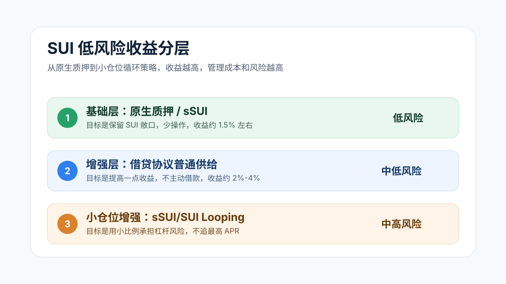

# SUI 现货低风险收益策略：从质押、借贷到小仓位循环

如果手里有一笔 SUI 现货，最自然的问题是：有没有办法在不承担太多风险的前提下，让它多产生一点收益？

我自己的判断是：有，但不要从“哪里 APR 最高”开始看。

对 SUI 这种波动资产来说，真正重要的是两件事：

- 尽量保留 SUI 本身的上涨敞口
- 不为了多几个百分点的年化收益，把本金暴露在复杂杠杆和跨资产风险里

所以这篇文章不是在找最高收益，而是在整理一个更稳的思路：**把 SUI 收益分成三层，基础层拿确定性，增强层拿一点协议收益，小仓位再尝试循环策略。**

> 说明：本文数据来自 2026-07-01 当天查看到的公开页面和 DeFi 应用页面。DeFi APR 变化很快，实际操作前需要重新确认。本文只是个人研究记录，不构成投资建议。

## 一、先建立收益基准

在比较各种策略之前，先看最基础的收益：原生 SUI 质押。

2026-07-01 查看时：

| 来源 | 观察到的收益 |
|---|---:|
| SuiVision Validators | AVG APY 约 `1.6%` |
| SuiScan Validators | Avg. APY 约 `1.474%` |
| SpringSui | SUI -> sSUI APR 约 `1.46%` |

这就是当前 SUI 的低风险收益基准，大概在 `1.5%` 左右。

这个收益不高，但它很重要。因为后面所有更高收益，本质上都要回答一个问题：

**多出来的收益，是从哪里来的？**

如果只是原生质押，风险主要来自验证节点表现、赎回等待和网络本身。如果收益突然提高到 `5%`、`8%` 甚至 `12%`，通常就已经引入了额外来源：借贷利差、奖励代币、杠杆循环、稳定币风险、LST 风险或协议风险。

## 二、几类策略的收益和风险

下面是 2026-07-01 观察到的一组数据。它不应该被当成固定收益表，而应该被当成风险地图。

| 策略 | 当时看到的收益 | 是否保留 SUI 敞口 | 主要风险 | 风险等级 |
|---|---:|---|---|---|
| 原生 SUI 质押 | 约 `1.47%-1.60% APY` | 是 | 验证节点表现、赎回等待、收益低 | 低 |
| SpringSui：SUI -> sSUI | `1.46% APR` | 是 | LST 合约风险、sSUI/SUI 汇率风险、退出费 | 低-中 |
| Suilend 存 SUI | `1.57% APR` | 是 | 借贷协议合约风险、利率波动 | 中低 |
| Suilend 存 sSUI | `2.70% APR*` | 是 | LST 风险叠加借贷协议风险，奖励可能变化 | 中 |
| NAVI 存 SUI | 页面显示约 `2.194% + 1.836%` | 是 | 协议风险、奖励波动、利率波动 | 中 |
| NAVI 存 vSUI / haSUI | vSUI 约 `2.705% + 1.507%`，haSUI 约 `2.980% + 1.698%` | 是 | LST 风险、协议风险、奖励不可持续 | 中 |
| Suilend sSUI/SUI Looping | Max APR `8.96%` | 是 | 杠杆循环、清算风险、利率变化、合约风险 | 中高 |
| Suilend USDsui/USDC Looping | Max APR `12.51%` | 否 | 失去 SUI 敞口、稳定币风险、杠杆风险 | 高 |

这里最容易误判的是 Suilend Strategies 里的 `Max APR`。

例如 sSUI/SUI Looping 当时显示 Max APR `8.96%`，看起来比普通质押高很多。但这个收益不是凭空来的，它来自循环策略，也就是不断抵押、借出、再抵押的结构。页面本身也明确提示了清算风险、合约风险和利率变化风险。

所以它可以作为增强层，但不适合作为全部仓位的基础层。

## 三、我会怎么分层

如果目标是“低风险地提高 SUI 收益”，我会把仓位分成三层。

| 层级 | 目标 | 可选方案 | 收益区间的直觉 |
|---|---|---|---:|
| 基础层 | 保留 SUI 敞口，降低操作复杂度 | 原生质押、SpringSui sSUI | `1.5%` 左右 |
| 增强层 | 不主动加杠杆，拿一点协议收益 | Suilend 存 SUI/sSUI、NAVI 存 SUI/LST | `2%-4%` 左右 |
| 小仓位增强层 | 接受一定杠杆风险，换取更高 APR | Suilend sSUI/SUI Looping | 取决于杠杆和市场利率 |

这个分层的核心不是收益最大化，而是让每一层承担清楚的职责。

基础层负责“不出事”。增强层负责“比纯质押多一点”。小仓位增强层负责“试探更高收益”，但不能让它反过来决定整个组合的安全性。

## 四、一个更稳的组合示例

假设持有 `2713 SUI`，我会更偏向这样的分配：

| 分配 | 数量 | 用途 |
|---|---:|---|
| 60% | 约 `1628 SUI` | 原生质押或换成 sSUI |
| 30% | 约 `814 SUI` | Suilend / NAVI 普通供给 |
| 10% | 约 `271 SUI` | Suilend sSUI/SUI Looping，低杠杆尝试 |

这样做的好处是：

- 大部分仓位仍然保留 SUI 敞口
- 不需要为了收益把 SUI 大量换成稳定币
- 协议风险和杠杆风险被限制在可控范围
- 即使循环策略收益下降，也不会影响整个组合的主体逻辑

如果更保守，可以把小仓位增强层降到 `5%`，甚至完全不做。这样组合收益会低一些，但风险也更干净。

如果更激进，也不建议直接把循环策略拉到 `50%` 以上。因为一旦利率变化、LST 折价或市场剧烈波动，管理难度会明显上升。

## 五、哪些收益我会谨慎看待

第一类是稳定币策略。

比如 USDsui/USDC Looping 当时显示 Max APR `12.51%`，数字很高。但如果原本持有的是 SUI，进入这类策略通常意味着把一部分 SUI 变成稳定币敞口。这样虽然可能拿到更高 APR，却可能错过 SUI 本身上涨。

这不是坏策略，只是它已经不再是“SUI 现货低风险收益策略”。

第二类是标记为 Deprecated 或 Deprecating 的资产。

这类资产即使收益看起来还可以，也不适合作为低风险策略的核心。项目方已经给出迁移或下线信号，普通用户没必要为了几个百分点的收益承担额外退出风险。

第三类是奖励占比很高的 APR。

很多借贷协议会把基础利率和奖励收益放在一起展示。奖励可能来自协议代币、活动补贴或阶段性激励。它们能提高当下 APR，但持续性通常不如原生质押稳定。

## 六、我的结论

SUI 低风险收益的合理目标，不应该是追到 `8%-12%`。

更现实的目标是：

- 基础层拿 `1.5%` 左右的质押收益
- 增强层把整体收益抬到 `2%-4%`
- 小仓位尝试循环策略，但不让杠杆策略决定本金安全

如果只用一句话总结：

**SUI 收益策略的重点不是找到最高 APR，而是在保留现货敞口的前提下，把风险分层。**

APR 越高，越要问清楚它来自哪里。只要这个问题回答不清楚，收益再高也不应该重仓。

## 参考来源

- SuiVision Validators：`https://suivision.xyz/validators`
- SuiScan Validators：`https://suiscan.xyz/mainnet/validators`
- SpringSui：`https://springsui.com/SUI-sSUI`
- Suilend：`https://suilend.fi/`
- Suilend Strategies：`https://suilend.fi/strategies`
- NAVI Protocol：`https://app.naviprotocol.io/`

---

## 发布信息

- 发布日期：2026-07-01
- 更新日期：2026-07-01
