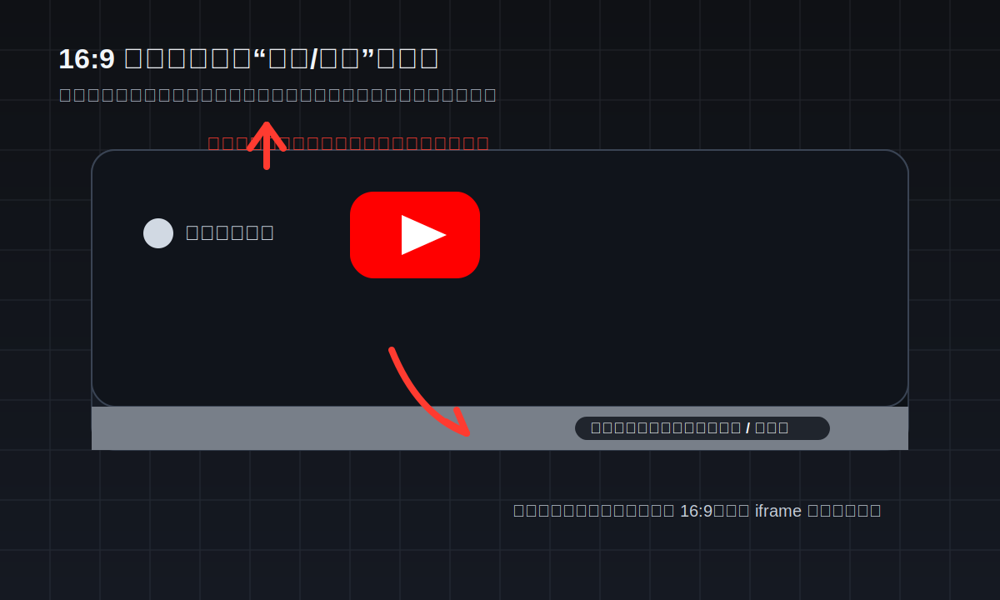

# YouTube 视频嵌入：URL 解析与 16:9 iframe 自适应比例实践

在 Web 应用里嵌入 YouTube 视频，看起来通常只是两件事：

- 把用户粘贴的链接解析成可用的 embed URL
- 让 iframe 在各种容器里保持正确比例

真正做起来以后，问题会比预想中多一些。

一类问题来自 URL 本身。用户粘贴的链接不一定是标准格式，甚至可能出现 `?` 和 `&` 混用的情况，导致 `URL` 解析结果和预期不一致。

另一类问题来自布局。iframe 容器如果不是 16:9，YouTube 播放器就很容易出现左右黑边、底部白边/灰边，视觉上会显得很“卡”。

这篇文章把这两个问题拆开讲。

## 一、YouTube URL 解析

### 1. 需要兼容的常见格式

实际场景里，YouTube 链接不只一种：

```txt
https://www.youtube.com/watch?v=abc123&t=120
https://youtu.be/abc123?t=120
https://www.youtube.com/shorts/abc123
https://www.youtube.com/live/abc123
```

更麻烦的是，有些链接会出现格式错误，比如把第二个参数也写成 `?`：

```txt
https://www.youtube.com/watch?v=abc123?t=951s
https://www.youtube.com/watch?v=abc123?si=xxx&t=100
```

这类链接在真实产品里并不少见，通常来自用户手动复制，或者某些平台生成了不太标准的地址。

### 2. 双问号带来的解析陷阱

如果直接交给浏览器的 `URL` 构造函数，第二个 `?` 不会被当成参数分隔符，而会被视为普通字符：

```ts
const url = new URL("https://www.youtube.com/watch?v=abc123?t=951s");

url.searchParams.get("v"); // "abc123?t=951s"
url.searchParams.get("t"); // null
```

也就是说，`v` 参数会被污染，`t` 参数则丢失。

### 3. 处理思路

我的处理方式分两步：

1. 先清理 `v` 参数，去掉被错误拼进来的 `?` 后缀
2. 再从原始字符串里兜底提取 `t` 参数

```ts
const parseYoutubeTime = (timeParam: string | null): number => {
  if (!timeParam) return 0;

  // 兼容 1h2m3s / 2m30s / 30s / 123 这类格式
  if (/[hms]/i.test(timeParam)) {
    const hours = Number(timeParam.match(/(\d+)h/i)?.[1] || 0);
    const minutes = Number(timeParam.match(/(\d+)m/i)?.[1] || 0);
    const seconds = Number(timeParam.match(/(\d+)s/i)?.[1] || 0);
    return hours * 3600 + minutes * 60 + seconds;
  }

  return Number(timeParam) || 0;
};
```

```ts
const parseYoutubeEmbed = (href: string) => {
  try {
    const urlObj = new URL(href);

    if (!urlObj.host.includes("youtube.com") && !urlObj.host.includes("youtu.be")) {
      return null;
    }

    // 1. 提取视频 ID
    let id = urlObj.searchParams.get("v");

    // 修复类似 ?v=abc123?si=xxx 的错误拼接
    if (id?.includes("?")) {
      id = id.split("?")[0];
    }

    if (!id) {
      const pathItems = urlObj.pathname.split("/");

      if (pathItems.length > 2 && ["shorts", "live"].includes(pathItems[1])) {
        id = pathItems[2];
      } else {
        id = urlObj.pathname.match(/\/([\w-]+)\/?/)?.[1] || null;
      }
    }

    if (!id) return null;

    // 2. 提取时间参数
    const timeParam =
      urlObj.searchParams.get("t") ||
      href.match(/[?&]?t=([^&?#\s]+)/)?.[1] ||
      null;

    // 3. 拼装 embed 链接
    const start = parseYoutubeTime(timeParam);
    const startQuery = start > 0 ? `start=${start}` : "";
    const autoplayQuery = `${startQuery ? "&" : ""}autoplay=1&mute=1&playsinline=1`;
    const query = `?${startQuery}${autoplayQuery}`;

    return `https://www.youtube.com/embed/${id}${query}`;
  } catch {
    return null;
  }
};
```

### 4. 为什么要加正则兜底

`searchParams.get("t")` 只能处理标准查询参数。

但真实世界里的输入不一定标准，所以我会再从原始 URL 字符串里补一层兜底：

```ts
href.match(/[?&]?t=([^&?#\s]+)/)?.[1]
```

这个正则的目的很简单：

- 允许 `t` 前面是 `?` 或 `&`
- `&`、`?`、`#`、空格都视为结束
- 避免把锚点或多余空白也吃进去

这一步不是为了“更优雅”，只是为了让实际输入更稳。

### 5. YouTube 的时间格式要统一转成秒

YouTube 的 `t` 参数支持多种格式：

| 格式 | 示例 | 含义 |
|------|------|------|
| 纯数字 | `123` | 123 秒 |
| `Ns` | `30s` | 30 秒 |
| `Nm` | `2m` | 120 秒 |
| `NmNs` | `2m30s` | 150 秒 |
| `NhNmNs` | `1h2m3s` | 3723 秒 |

但 embed URL 的 `start` 参数最终还是要用纯数字秒数，所以需要先统一转换。

## 二、iframe 黑边和白边问题

### 1. 问题现象

如果 iframe 容器宽高比不是 16:9，通常会看到两种现象：

- 视频左右出现黑边
- 底部出现一块白边或灰色区域

这不是你“样式没调好”这么简单，而是容器比例和播放器比例不一致导致的。



上面这张图更准确地说明了这个现象：

- 中间是视频主体区域
- 底部那条看起来像“白边”的部分，其实是播放器在比例不匹配时保留出来的区域
- 当容器不是 16:9 时，这类空白就会更明显

### 2. 错误写法

如果直接给容器固定宽高，或者只写 `width: 100%; height: 100%`，但容器本身不是 16:9，就很容易出问题：

```css
.container {
  width: 400px;
  max-height: 50vh;
}

iframe {
  width: 100%;
  height: 100%;
}
```

YouTube 播放器的标准比例是 16:9。容器一旦偏离这个比例，播放器就会用自己的方式去“补”空白区域。

### 3. 推荐方案：`padding-bottom` 比例容器

这是一个很经典的 CSS 技巧。

`padding-bottom` 的百分比是相对于**父元素宽度**计算的，所以可以用它来稳定创建固定宽高比容器。

16:9 的换算如下：

```txt
9 / 16 = 0.5625 = 56.25%
```

对应写法：

```css
.container {
  width: 400px;
  position: relative;
  padding-bottom: 56.25%;
}

iframe {
  position: absolute;
  inset: 0;
  width: 100%;
  height: 100%;
}
```

Tailwind 写法也很直接：

```html
<div class="w-[400px] relative pb-[56.25%]">
  <iframe class="absolute inset-0 w-full h-full" src="..." />
</div>
```

### 4. 为什么这个方案更稳

`aspect-ratio` 现在已经很好用了，但在一些更复杂的布局里，比如嵌在 Popover、Tooltip、浮层容器中时，`padding-bottom` 方案仍然更稳妥。

它的优势主要在于：

- 兼容性更好
- 对布局上下文依赖更少
- 对动态尺寸计算更稳定

如果你的页面结构比较简单，`aspect-ratio` 当然也可以用；但如果是工程场景，我更倾向于用 `padding-bottom`。

## 三、完整实现

```tsx
const parseYoutubeTime = (timeParam: string | null): number => {
  if (!timeParam) return 0;

  if (/[hms]/i.test(timeParam)) {
    const hours = Number(timeParam.match(/(\d+)h/i)?.[1] || 0);
    const minutes = Number(timeParam.match(/(\d+)m/i)?.[1] || 0);
    const seconds = Number(timeParam.match(/(\d+)s/i)?.[1] || 0);
    return hours * 3600 + minutes * 60 + seconds;
  }

  return Number(timeParam) || 0;
};

const parseYoutubeEmbed = (href: string) => {
  try {
    const urlObj = new URL(href);

    if (!urlObj.host.includes("youtube.com") && !urlObj.host.includes("youtu.be")) {
      return null;
    }

    let id = urlObj.searchParams.get("v");

    if (id?.includes("?")) {
      id = id.split("?")[0];
    }

    if (!id) {
      const pathItems = urlObj.pathname.split("/");

      if (pathItems.length > 2 && ["shorts", "live"].includes(pathItems[1])) {
        id = pathItems[2];
      } else {
        id = urlObj.pathname.match(/\/([\w-]+)\/?/)?.[1] || null;
      }
    }

    if (!id) return null;

    const timeParam =
      urlObj.searchParams.get("t") ||
      href.match(/[?&]?t=([^&?#\s]+)/)?.[1] ||
      null;

    const start = parseYoutubeTime(timeParam);
    const startQuery = start > 0 ? `start=${start}` : "";
    const autoplayQuery = `${startQuery ? "&" : ""}autoplay=1&mute=1&playsinline=1`;
    const query = `?${startQuery}${autoplayQuery}`;

    return `https://www.youtube.com/embed/${id}${query}`;
  } catch {
    return null;
  }
};
```

```tsx
const YoutubePreview = ({ src }: { src: string }) => (
  <div className="w-[400px] relative pb-[56.25%]">
    <iframe
      className="absolute inset-0 w-full h-full"
      src={src}
      frameBorder="0"
      allow="accelerometer; autoplay; clipboard-write; encrypted-media; gyroscope; picture-in-picture"
      allowFullScreen
    />
  </div>
);
```

## 四、总结

这类需求看起来只是“嵌入一个视频”，但实际会碰到两个很典型的工程问题：

1. 用户输入不一定标准，URL 解析要有兜底
2. iframe 不只是能显示就行，还要在视觉上稳定

最后整理下结论：

| 问题 | 原因 | 解决方式 |
|------|------|---------|
| 双问号参数丢失 | `URL` 把第二个 `?` 当成普通字符 | 清理 `v` 参数，并用正则兜底提取 `t` |
| 时间参数格式不统一 | YouTube 支持 `1h2m3s` 等写法 | 统一转换为秒数 |
| 视频黑边和底部白边/灰区 | 容器比例不是 16:9 | 用 `padding-bottom: 56.25%` 构建比例容器 |

如果要给这个方案一句话总结，就是：

**URL 解析要容错，布局比例要稳定。**

---

## 发布信息

- 发布日期：2026-03-30
- 主题：YouTube 视频嵌入、URL 解析、iframe 比例布局
